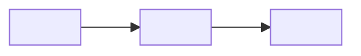

# TS-<MODÜL>-<NNN> — <Teknik başlık>

> Şablon: `%sap-fs-ts-docs` → `references/ts-authoring.md`. FS onaylanmadan doldurulmaz. Boş bırakılan zorunlu bölüm
> "Uygulanmaz — <gerekçe>" yazılır, silinmez. Obje adları `%sap-dev` → `references/naming.md` + paket `.rules.md`.

| Alan | Değer |
|---|---|
| Doküman no | TS-<MODÜL>-<NNN> |
| İlgili FS | FS-<MODÜL>-<NNN> v<sürüm> (zorunlu) |
| Proje | <proje> |
| SAP profili / sürüm | <ecc / s4_private / s4_public / btp_abap> / <sürüm> |
| Geliştirme tipi | <rapor / iyileştirme / arayüz / dönüşüm / form / iş akışı> |
| Hazırlayan | <rol ya da ad> |
| Tarih | <GG.AA.YYYY> |
| Versiyon | v<1.0> |
| Transport | <kullanıcıdan — yoksa "atanacak"> |
| Durum | Taslak |

## 1. Doküman kontrolü

### 1.1 Versiyon geçmişi
| Versiyon | Tarih | Değiştiren | Ne değişti |
|---|---|---|---|
| v1.0 | <tarih> | <rol> | İlk sürüm |

### 1.2 İlgili dokümanlar
| Doküman | No | Not |
|---|---|---|
| Fonksiyonel spesifikasyon | FS-<MODÜL>-<NNN> | onaylı sürüm <v> |
| Kullanıcı dokümanı | KD-<MODÜL>-<NNN> | <geliştirme sonrası> |

## 2. Teknik genel bakış

### 2.1 Özet
| Konu | Değer |
|---|---|
| Etkilenen süreç | <…> |
| Yeni / mevcut üzerine | <…> |
| Genişletme seviyesi | <1 anahtar kullanıcı / 2 geliştirici-released API / 3 yan uygulama / 4 klasik> |
| 4. seviye istisna gerekçesi | <Uygulanmaz / gerekçe> |
| Clean core uyumu | <released API/CDS kullanımı, standart objeye dokunulmaması> |

**Varsayımlar ve kullanıcı cevapları:** <soru → cevap; yanıtlanmayan → [Varsayım]>

### 2.2 Teknik mimari


## 2-A. FS denetimi
| FS maddesi | Durum (✅ / ⚠ / ⛔ / 💥 / ✗) | Bulgu ve kanıt | Genişletme seviyesi | Aksiyon |
|---|---|---|---|---|
| FR-001 | ✅ | <denetlendi, temiz> | <2> | — |

## 3. Geliştirme nesneleri
| Tip | Ad | Paket | Açıklama | Durum |
|---|---|---|---|---|
| <CLAS / DDLS / TABL / PROG / MSAG …> | <ad> | <paket> | <açıklama> | Yeni |

## 4. Veri sözlüğü

### 4.1 Domain
| Ad | Tip | Uzunluk | Sabit değerler |
|---|---|---|---|
| <Uygulanmaz — gerekçe> | | | |

### 4.2 Data element
| Ad (kullanıcı verir) | Domain / tip | Kısa | Orta | Uzun | Başlık |
|---|---|---|---|---|---|
| <…> | <…> | <…> | <…> | <…> | <…> |

### 4.3 Tablo
| Alan | DTEL | Anahtar | Açıklama |
|---|---|---|---|
| CLIENT | MANDT | ✔ | İstemci |

### 4.4 Index
| Ad | Alanlar | Gerekçe |
|---|---|---|
| <Uygulanmaz — gerekçe> | | |

## 4.5 Ekran / UI tasarımı

### 4.5.1 Ekran listesi
| No | Ekran / view | Tip | FS karşılığı |
|---|---|---|---|
| SCR-001 | <ad> | <liste / detay / diyalog> | FS §5.2 |

### 4.5.2 SCR-001 — <ad>
```
┌────────────────────────────────────────────┐
│ <ayrıntılı mockup>                          │
└────────────────────────────────────────────┘
```

**(a) Alan tablosu**
| Teknik ad | Etiket | Tip / uzunluk | Zorunlu | Varsayılan | Değer yardımı | Düzenlenebilir (oluştur / değiştir) | Doğrulama |
|---|---|---|---|---|---|---|---|
| <…> | <…> | <…> | <…> | <…> | <…> | <…> | <…> |

**(b) Buton / aksiyon tablosu**
| Buton | Etiket | Olay | Etkin olma koşulu | Çağırdığı servis |
|---|---|---|---|---|
| <…> | <…> | <…> | <…> | <…> |

**(c) Grid kolon tablosu (tüm kolonlar, başlık metniyle)**
| Kolon | Başlık metni | Tip | Düzenlenebilir | Sıralama / filtre | Hesaplama / biçim |
|---|---|---|---|---|---|
| <…> | <…> | <…> | <…> | <…> | <…> |

**(d) Açıklama kolonu kararı**
| Kod alanı | Açıklama kolonu | Kaynak (tablo-alan / released CDS + dil) ya da eklenmeme gerekçesi |
|---|---|---|
| <…> | <Evet / Hayır> | <…> |

**(e) Klasik ALV alan kataloğu kararı**
<DDIC yapısından / elle — gerekçe; yapı seçildiyse yapı adı (kullanıcı onaylı) ve alan→DTEL eşlemesi §4'te>

### 4.5.3 Etkileşim matrisi
| Olay | Koşul | Sistem tepkisi | Mesaj (§10.1) |
|---|---|---|---|
| <…> | <…> | <…> | <sınıf/no> |

### 4.5.4 Kullanılan API / OData ve test yöntemi
| Servis / API | Released mı (canlı teyit) | Kullanım | Test yöntemi |
|---|---|---|---|
| <…> | <…> | <…> | <…> |

## 5. Program / sınıf tasarımı

### 5.1 Program yapısı
<klasik program: ana program + include'lar; RAP: davranış tanımı + uygulama sınıfı>

### 5.2 Sınıf ve metot imzaları
| Sınıf | Metot | Tip (statik / örnek / özel) | Parametreler (ad : tip) | Dönüş | Açıklama |
|---|---|---|---|---|---|
| <…> | <…> | <…> | <…> | <…> | <…> |

### 5.3 Sözde kod
**`<SINIF>=>METOT`**
1. <adım>
2. <adım>

## 6. Veritabanı erişimi

### 6.1 Kullanılan tablolar / CDS
| Tablo / CDS | Erişim | Released | Amaç |
|---|---|---|---|
| <…> | Okuma | <…> | <…> |

### 6.2 Kritik okumalar
<gereken alanlar, anahtarlar, toplu okuma>

### 6.3 Performans
- <WHERE'siz okuma yok · döngü içinde okuma yok · büyük veride paketleme>

## 7. İyileştirmeler
| Tip | Ad (BAdI / spot / exit) | Implementasyon adı (kullanıcı onaylı) | Sözde kod |
|---|---|---|---|
| <Uygulanmaz — gerekçe> | | | |

## 8. Form / çıktı
<Uygulanmaz — gerekçe | form tipi, driver, çıktı tipi, yapı>

## 9. Arayüz / RFC
<Uygulanmaz — gerekçe | FM imzası, parametreler, hata durumları, senkron/asenkron>

## 10. Hata yönetimi

### 10.1 Mesaj envanteri
| Mesaj sınıfı | No | Tip | Metin (birebir, ≤ 73) | Yer tutucular (&1..&4 = anlam) | Üretim noktası | Kullanıcı aksiyonu (E/A) |
|---|---|---|---|---|---|---|
| <sınıf> | 001 | E | <kullanıcıdan gelen metin> | &1 = <…> | `<SINIF>=>METOT` | <…> |

Uzun metin: <yok | "SE91'de elle girilir">

### 10.2 İstisna yönetimi
<istisna sınıfları ve yakalama deseni>

## 11. Test

### 11.1 Birim test
| No | Sınıf / metot | Koşul | Beklenen |
|---|---|---|---|
| UT-001 | <…> | <…> | <…> |

### 11.2 Entegrasyon testi
| No | Senaryo | Beklenen | Bağlı kabul kriteri |
|---|---|---|---|
| IT-001 | <…> | <…> | FS KR-001 |

## 11-A. Build-time doğrulanacaklar (yalnız teknik teyit)
| No | Madde | Yöntem | Neden ertelenebilir |
|---|---|---|---|
| BT-01 | <…> | <canlı okuma / sözdizimi> | <tasarımı değiştirmez çünkü …> |

## 12. Transport stratejisi
| Sıra | İçerik | Transport (kullanıcıdan) |
|---|---|---|
| 1 | DDIC (domain, DTEL, tablo, yapı) | <…> |
| 2 | Mesaj sınıfı | <…> |
| 3 | Program / sınıf / fonksiyon | <…> |
| 4 | İşlem kodu / yetki | <…> |
| 5 | Uyarlama | <…> |

## İzlenebilirlik matrisi
| FS gereksinim | FS açıklaması | TS bölümü | TS obje / metot | Test |
|---|---|---|---|---|
| FR-001 | <…> | §5.3 | `<SINIF>=>METOT` | UT-001, IT-001 |

## Canlı teyit turu
<Rapor tablosu (`references/live-confirmation-tour.md` §2) ya da "canlı teyit bekliyor — <neden>">

## 13. Onay
| Rol | Ad | Tarih | İmza |
|---|---|---|---|
| Hazırlayan | | | |
| Teknik lider | | | |
| Mimar | | | |
